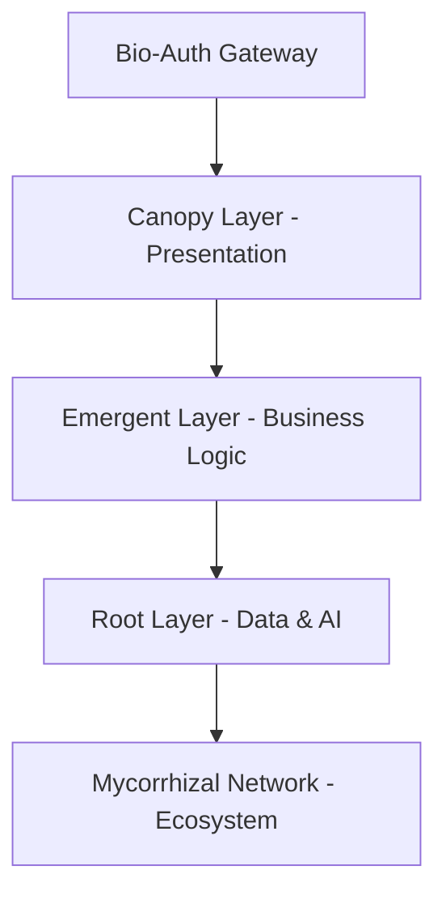

# Digital Savannah Marketplace

> **Bio-Mimetic Enterprise Ecosystem** – An AI-native marketplace for mega-corporations, merging wildlife-inspired resilience with infinite revenue loops.

---

## 🌍 Vision

Unify Savannah’s fragmented enterprise tools into a single, self-sustaining digital ecosystem. Empower Fortune 500 corps, mid-tier enterprises, and scaling organizations with tiered AI dashboards, data symbiosis, and a **negative‑churn revenue engine** that grows with every transaction.

## 🔥 Problem We Solve

- **Siloed data & rigid pricing** – no unified platform for B2B commerce in the Savannah DMA (364K+ households).  
- **Inefficient revenue models** – local agencies offer fixed packages ($1.5K–$8K/mo) that fail to scale with corporate growth.  
- **No ecosystem lock‑in** – corporations lack integrated tools for supply chain, ESG, and collaborative intelligence.

**Our Solution** – a marketplace where:
- **Platinum** (Fortune 500) gets digital twins, quantum security, and AI concierges.  
- **Gold** (1,000+ employees) benefits from federated learning and advanced analytics.  
- **Silver** (scaling orgs) enjoys modular dashboards and growth hacking.

---

## 🧬 Architecture: Bio‑Digital Organism Stack

| Layer | Inspiration | Technology |
|-------|-------------|------------|
| **Organism Units** | Cells, ant colonies | WebAssembly modules + zero‑trust membranes |
| **Neuro‑Synaptic Mesh** | Nervous system | Quantum‑resistant routers, tiered data axons (photon/HTTP3) |
| **Evolutionary Engine** | Natural selection | Genetic algorithms for model adaptation, auto‑apoptosis |
| **Holographic Data Mycelium** | Fungal networks | Light‑encoded spores + crystal lattice storage |
| **Epigenetic Identity Mesh** | Immune system | Behavioral auth, 0‑day threat immunity |



---

## ♻️ Infinite Revenue Loop

| Revenue Stream | Mechanism | Bio‑Metaphor |
|----------------|-----------|--------------|
| **Subscription** | Tiered fees ($25K–$250K+/yr) | Base energy flow |
| **Transaction Fees** | 0.5–1.5% on B2B deals | Pollination tax |
| **AI/Data Services** | $5K–$50K/mo predictive analytics | Nutrient extraction |
| **Premium Add‑ons** | Digital twin ($100K/yr), ESG ($20K/mo) | Ecosystem services |
| **Growth Rebates** | 5‑10% discount for referrals | Symbiosis rewards |
| **Data Monetization** | 15‑30% rev share on anonymised insights | Mycorrhizal exchange |

**Negative Churn** – existing clients expand spending 20–50% YoY via upsells detected by AI “Predator” models.

---

## 🏗️ Team Structure (Bio‑Inspired)

| Squad | Focus | Skills | Owns Tier |
|-------|-------|--------|-----------|
| **Platinum Predators** | Digital twins, quantum security | AI/ML, blockchain, HPC | Fortune 500 |
| **Gold Symbionts** | API ecosystems, federated learning | GraphDB, DevOps, analytics | Mid‑corps |
| **Silver Swarms** | Dashboard UX, SMB onboarding | React/Vue, growth hacking | Scaling orgs |
| **Mutation Engine** | R&D, code evolution | GA, adversarial testing | All |
| **Energy Cyclers** | Tokenomics, resource allocation | SRE, FinOps | All |
| **Mycorrhizal Network** | Partner integrations | BizDev, strategic alliances | All |

**Autonomy**: Each squad owns P&L and receives 20% revenue share. Underperformers auto‑merge via “extinction events”.

---

## 📦 Getting Started (Developer)

### Prerequisites
- Kubernetes v1.27+
- Python 3.10 + TensorFlow Extended
- Node.js 18+ (for dashboard micro‑frontends)
- Redis, Kafka, Delta Lake

### Quick Install
```bash
git clone https://github.com/digital-savannah/marketplace.git
cd marketplace
make setup
make deploy-tier platinum  # or gold, silver
```

### Environment Variables
```bash
export TIER=platinum
export QUANTUM_ENABLED=true
export BLOCKCHAIN_NETWORK=hyperledger
```

---

## 🔬 Monitoring – Savannah Dashboard

- **Revenue Rainfall** – real‑time transaction heatmap  
- **Biodiversity Index** – model type entropy  
- **Trophic Efficiency** – revenue per tier  
- **Immune Alerts** – threat detection (🦠) and drought warnings (⚠️)

---

## 🤝 Contributing

We welcome **gene exchanges** (pull requests) and **symbiotic partnerships**. Please read our [Evolutionary Code of Conduct](CODE_OF_CONDUCT.md) before submitting.

---

## 📄 License

Proprietary – all rights reserved. Tiered access agreements apply.

---

## 🌿 Acknowledgements

Inspired by the African savannah, mycorrhizal networks, and the resilience of nature’s ecosystems. Built for a future where commerce evolves, adapts, and thrives.

> **Math Before Marketing** – every KPI fuels the loop.

---

*For more details, see [Architecture Deep Dive](docs/architecture.md) and [Revenue Model](docs/revenue-loop.md).*
